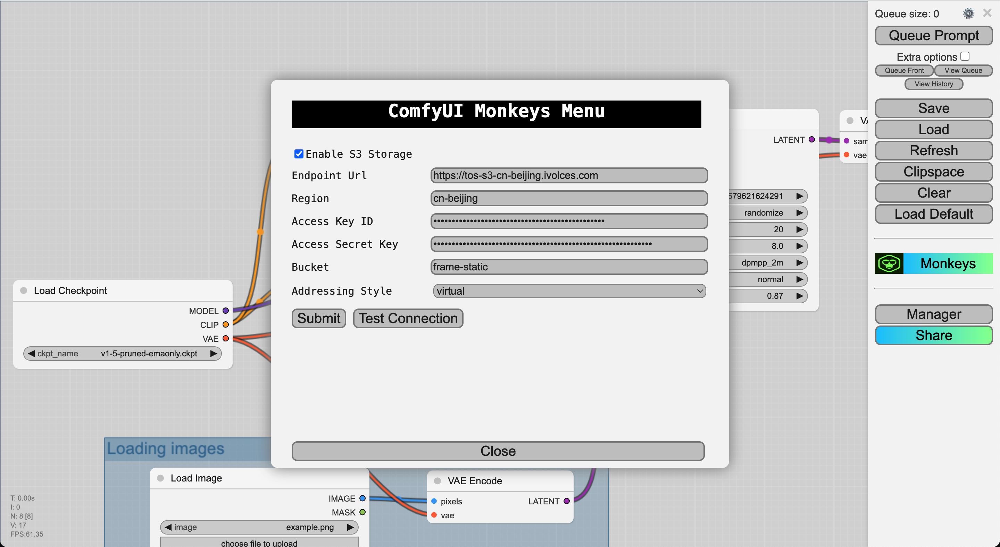

# ComfyUI Monkeys

**ComfyUI_Monkeys** is an extension designed to integrate [ComfyUI](https://github.com/comfyanonymous/ComfyUI)
with [Monkeys Platform](https://ai.infmonkeys.com).
It made it's possible to run ComfyUI workflow by external services easily by HTTP APIs, and the ability to run ComfyUI
workflow as single Block in **Monkeys Workflow Engine**.

## Installation

To install ComfyUI-Manager in addition to an existing installation of ComfyUI, you can follow the following steps:

1. goto `ComfyUI/custom_nodes` dir in terminal(cmd)
2. `git clone https://github.com/inf-monkeys/monkey-tools-comfyui.git`
3. Restart ComfyUI

